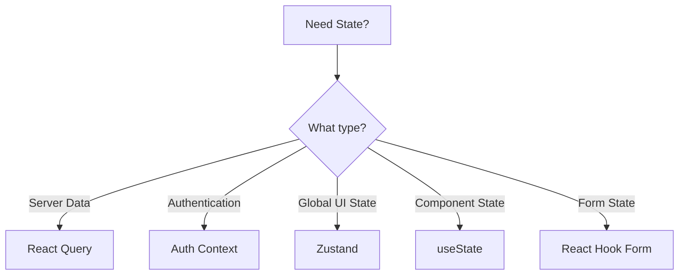

## Overview

SIGEAC uses a hybrid approach to state management, combining different solutions for different types of state:

<CardGroup cols={3}>
  <Card title="React Query" icon="server">
    Server state & data fetching
  </Card>
  <Card title="Zustand" icon="cube">
    Client-side global state
  </Card>
  <Card title="React Context" icon="circle-nodes">
    Authentication & theme
  </Card>
</CardGroup>

## Server State with React Query

React Query manages all server state, including data fetching, caching, and synchronization.

### Setup

The `QueryClientProvider` wraps the entire application:

```tsx app/layout.tsx
import { QueryClient, QueryClientProvider as RQQueryClientProvider } from '@tanstack/react-query'

const queryClient = new QueryClient()

export default function RootLayout({ children }) {
  return (
    <html>
      <body>
        <QueryClientProvider client={queryClient}>
          {children}
        </QueryClientProvider>
      </body>
    </html>
  )
}
```

See: `providers/query-provider.tsx:6`

### Query Pattern

Create custom hooks for data fetching:

```typescript hooks/general/clientes/useGetClients.ts
import axiosInstance from "@/lib/axios"
import { Client } from "@/types"
import { useQuery } from "@tanstack/react-query"

const fetchClients = async (company: string | undefined): Promise<Client[]> => {
  const { data } = await axiosInstance.get(`/${company}/clients`)
  return data
}

export const useGetClients = (company: string | undefined) => {
  return useQuery<Client[]>({
    queryKey: ["clients", company],
    queryFn: () => fetchClients(company),
    staleTime: 1000 * 60 * 2, // 2 minutes
    enabled: !!company,
  })
}
```

See: `hooks/general/clientes/useGetClients.ts:1`

#### Using the Query Hook

```tsx components/ClientList.tsx
import { useGetClients } from '@/hooks/general/clientes/useGetClients'
import { useCompanyStore } from '@/stores/CompanyStore'

export function ClientList() {
  const { selectedCompany } = useCompanyStore()
  const { data: clients, isLoading, error } = useGetClients(selectedCompany?.slug)
  
  if (isLoading) return <div>Loading...</div>
  if (error) return <div>Error: {error.message}</div>
  
  return (
    <ul>
      {clients?.map(client => (
        <li key={client.id}>{client.name}</li>
      ))}
    </ul>
  )
}
```

### Mutation Pattern

Create custom hooks for data mutations:

```typescript actions/general/clientes/actions.ts
import axiosInstance from "@/lib/axios"
import { useMutation, useQueryClient } from "@tanstack/react-query"
import { toast } from "sonner"

interface CreateClientData {
  name: string
  email?: string
  dni: string
  dni_type: string
}

export const useCreateClient = () => {
  const queryClient = useQueryClient()

  const createMutation = useMutation({
    mutationFn: async ({ company, data }: { company: string; data: CreateClientData }) => {
      const response = await axiosInstance.post(`/${company}/clients`, data)
      return response.data
    },
    onSuccess: () => {
      queryClient.invalidateQueries({ queryKey: ['clients'] })
      toast("¡Creado!", {
        description: `¡El cliente se ha creado correctamente!`
      })
    },
    onError: (error) => {
      toast.error("Error", {
        description: `No se creó correctamente: ${error}`
      })
    },
  })

  return { createClient: createMutation }
}
```

See: `actions/general/clientes/actions.ts:16`

#### Using the Mutation Hook

```tsx components/ClientForm.tsx
import { useCreateClient } from '@/actions/general/clientes/actions'
import { useCompanyStore } from '@/stores/CompanyStore'
import { useForm } from 'react-hook-form'

export function ClientForm() {
  const { selectedCompany } = useCompanyStore()
  const { createClient } = useCreateClient()
  const form = useForm()
  
  const onSubmit = (data) => {
    createClient.mutate({ 
      company: selectedCompany?.slug!, 
      data 
    })
  }
  
  return (
    <form onSubmit={form.handleSubmit(onSubmit)}>
      {/* Form fields */}
      <button type="submit" disabled={createClient.isPending}>
        {createClient.isPending ? 'Creating...' : 'Create Client'}
      </button>
    </form>
  )
}
```

### Query Key Patterns

<Tabs>
  <Tab title="List Queries">
    Use array keys with dependencies:
    
    ```typescript
    queryKey: ["clients", company]
    queryKey: ["employees", company, department]
    queryKey: ["articles", warehouse, category]
    ```
  </Tab>
  
  <Tab title="Detail Queries">
    Include the ID in the key:
    
    ```typescript
    queryKey: ["client", id]
    queryKey: ["employee", employeeId]
    queryKey: ["work-order", orderNumber]
    ```
  </Tab>
  
  <Tab title="Filtered Queries">
    Include filter parameters:
    
    ```typescript
    queryKey: ["flights", { dateRange, aircraft, status }]
    queryKey: ["reports", { from, to, type }]
    ```
  </Tab>
</Tabs>

### Cache Invalidation

Invalidate queries after mutations:

```typescript
// Invalidate all client queries
queryClient.invalidateQueries({ queryKey: ['clients'] })

// Invalidate specific client
queryClient.invalidateQueries({ queryKey: ['client', clientId] })

// Invalidate multiple related queries
queryClient.invalidateQueries({ queryKey: ['clients'] })
queryClient.invalidateQueries({ queryKey: ['flights'] })
```

### Optimistic Updates

Update UI before server response:

```typescript
export const useUpdateClient = () => {
  const queryClient = useQueryClient()

  return useMutation({
    mutationFn: async ({ id, data }) => {
      await axiosInstance.patch(`/clients/${id}`, data)
    },
    onMutate: async ({ id, data }) => {
      // Cancel outgoing queries
      await queryClient.cancelQueries({ queryKey: ['clients'] })
      
      // Get current data
      const previous = queryClient.getQueryData(['clients'])
      
      // Optimistically update
      queryClient.setQueryData(['clients'], (old: Client[]) => 
        old.map(client => client.id === id ? { ...client, ...data } : client)
      )
      
      return { previous }
    },
    onError: (err, variables, context) => {
      // Rollback on error
      queryClient.setQueryData(['clients'], context?.previous)
    },
    onSettled: () => {
      queryClient.invalidateQueries({ queryKey: ['clients'] })
    },
  })
}
```

## Client State with Zustand

Zustand manages client-side global state that doesn't belong on the server.

### Company Store

The main Zustand store manages company and location selection:

```typescript stores/CompanyStore.ts
import { Company } from "@/types"
import { create } from "zustand"

interface CompanyState {
  selectedCompany: Company | null
  selectedStation: string | null
}

interface CompanyActions {
  setSelectedCompany: (company: Company) => void
  setSelectedStation: (station: string) => void
  initFromLocalStorage: () => void
  reset: () => void
}

const initialState: CompanyState = {
  selectedCompany: null,
  selectedStation: null,
}

export const useCompanyStore = create<CompanyState & CompanyActions>((set) => ({
  ...initialState,

  setSelectedCompany: (company) => {
    set({ selectedCompany: company })
    localStorage.setItem('selectedCompany', JSON.stringify(company))
  },

  setSelectedStation: (station) => {
    set({ selectedStation: station })
    localStorage.setItem('selectedStation', station)
  },

  initFromLocalStorage: () => {
    const savedCompany = localStorage.getItem('selectedCompany')
    if (savedCompany) {
      try {
        const companyObj: Company = JSON.parse(savedCompany)
        set({ selectedCompany: companyObj })
      } catch (error) {
        console.error("Error parsing saved company", error)
        localStorage.removeItem('selectedCompany')
      }
    }

    const savedStation = localStorage.getItem('selectedStation')
    if (savedStation) {
      set({ selectedStation: savedStation })
    }
  },

  reset: () => {
    set(initialState)
    localStorage.removeItem('selectedCompany')
    localStorage.removeItem('selectedStation')
  }
}))
```

See: `stores/CompanyStore.ts:1`

### Using Zustand Stores

<Steps>
  <Step title="Import the store">
    ```typescript
    import { useCompanyStore } from '@/stores/CompanyStore'
    ```
  </Step>
  
  <Step title="Select state">
    ```typescript
    // Get the entire state
    const { selectedCompany, setSelectedCompany } = useCompanyStore()
    
    // Or use selectors for performance
    const selectedCompany = useCompanyStore(state => state.selectedCompany)
    const setCompany = useCompanyStore(state => state.setSelectedCompany)
    ```
  </Step>
  
  <Step title="Update state">
    ```typescript
    const handleCompanyChange = (company: Company) => {
      setSelectedCompany(company)
    }
    ```
  </Step>
</Steps>

### Server-Side Usage

Zustand stores can't be used in Server Components. Use the helper hook:

```typescript hooks/helpers/use-store.tsx
import { useState, useEffect } from 'react'

export const useStore = <T, F>(
  store: (callback: (state: T) => unknown) => unknown,
  callback: (state: T) => F
) => {
  const result = store(callback) as F
  const [data, setData] = useState<F>()

  useEffect(() => {
    setData(result)
  }, [result])

  return data
}
```

See: `hooks/helpers/use-store.tsx:1`

Usage:

```typescript
'use client'

import { useStore } from '@/hooks/helpers/use-store'
import { useCompanyStore } from '@/stores/CompanyStore'

export function CompanySelector() {
  const selectedCompany = useStore(
    useCompanyStore, 
    (state) => state.selectedCompany
  )
  
  return <div>{selectedCompany?.name}</div>
}
```

## Context API for Authentication

The AuthContext manages authentication state and user data:

```typescript contexts/AuthContext.tsx
import { createContext, ReactNode, useContext, useState, useCallback } from 'react'
import { User } from '@/types'
import { useQueryClient } from '@tanstack/react-query'
import { useRouter } from 'next/navigation'

interface AuthContextType {
  user: User | null
  isAuthenticated: boolean
  loading: boolean
  error: string | null
  logout: () => Promise<void>
}

const AuthContext = createContext<AuthContextType | undefined>(undefined)

export const AuthProvider = ({ children }: { children: ReactNode }) => {
  const queryClient = useQueryClient()
  const router = useRouter()
  const [user, setUser] = useState<User | null>(null)
  const [loading, setIsLoading] = useState(true)
  const [error, setError] = useState<string | null>(null)
  const { reset } = useCompanyStore()

  const isAuthenticated = useMemo(() => !!user, [user])

  const logout = useCallback(async () => {
    setUser(null)
    setError(null)
    await deleteSession()
    await reset()
    queryClient.clear()
    router.push('/login')
    toast.info('Sesión finalizada')
  }, [router, queryClient, reset])

  // Fetch user on mount
  useEffect(() => {
    const checkAuth = async () => {
      setIsLoading(true)
      if (document.cookie.includes('auth_token')) {
        await fetchUser()
      }
      setIsLoading(false)
    }
    checkAuth()
  }, [])

  return (
    <AuthContext.Provider value={{ user, isAuthenticated, loading, error, logout }}>
      {children}
    </AuthContext.Provider>
  )
}

export const useAuth = (): AuthContextType => {
  const context = useContext(AuthContext)
  if (!context) throw new Error('useAuth must be used within AuthProvider')
  return context
}
```

See: `contexts/AuthContext.tsx:1`

### Using Authentication

```tsx
import { useAuth } from '@/contexts/AuthContext'

export function UserProfile() {
  const { user, isAuthenticated, logout } = useAuth()
  
  if (!isAuthenticated) {
    return <div>Please log in</div>
  }
  
  return (
    <div>
      <h2>Welcome, {user.first_name}</h2>
      <button onClick={logout}>Logout</button>
    </div>
  )
}
```

## Local State with useState

For component-specific state, use React's built-in `useState`:

```tsx
import { useState } from 'react'

export function SearchBar() {
  const [search, setSearch] = useState('')
  const [isOpen, setIsOpen] = useState(false)
  
  return (
    <div>
      <input 
        value={search} 
        onChange={(e) => setSearch(e.target.value)}
      />
      <button onClick={() => setIsOpen(!isOpen)}>
        {isOpen ? 'Close' : 'Open'}
      </button>
    </div>
  )
}
```

## State Management Decision Tree



<Note>
**Quick Guide:**
- **Server data** (clients, flights, etc.) → React Query
- **Global settings** (company, location) → Zustand
- **User auth** → Auth Context
- **Component UI** (modals, dropdowns) → useState
- **Forms** → React Hook Form
</Note>

## Best Practices

<AccordionGroup>
  <Accordion title="Keep state close to where it's used">
    Only lift state to global stores when multiple components need it.
    
    ```tsx
    // ✗ Bad - unnecessary global state
    const modalOpen = useModalStore(state => state.isOpen)
    
    // ✓ Good - local component state
    const [modalOpen, setModalOpen] = useState(false)
    ```
  </Accordion>
  
  <Accordion title="Use proper query keys">
    Include all dependencies in query keys:
    
    ```tsx
    // ✗ Bad - missing dependency
    queryKey: ["clients"]
    
    // ✓ Good - includes company
    queryKey: ["clients", company]
    ```
  </Accordion>
  
  <Accordion title="Invalidate queries after mutations">
    Always invalidate related queries:
    
    ```tsx
    onSuccess: () => {
      queryClient.invalidateQueries({ queryKey: ['clients'] })
      queryClient.invalidateQueries({ queryKey: ['dashboard'] })
    }
    ```
  </Accordion>
  
  <Accordion title="Use selectors in Zustand">
    Prevent unnecessary re-renders:
    
    ```tsx
    // ✗ Bad - re-renders on any state change
    const store = useCompanyStore()
    
    // ✓ Good - only re-renders when company changes
    const company = useCompanyStore(state => state.selectedCompany)
    ```
  </Accordion>
</AccordionGroup>

## Next Steps

<CardGroup cols={2}>
  <Card title="Data Fetching" icon="cloud-arrow-down" href="/development/data-fetching">
    Learn data fetching patterns in detail
  </Card>
  <Card title="Custom Hooks" icon="link" href="/development/custom-hooks">
    Create reusable custom hooks
  </Card>
</CardGroup>