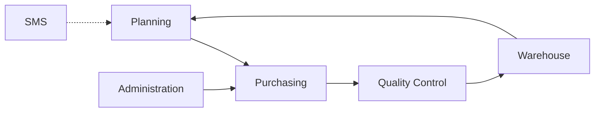

SIGEAC is a comprehensive aviation management SaaS platform designed for aircraft maintenance organizations, airlines, and aviation service providers. The platform consists of integrated modules that cover the complete lifecycle of aviation operations.

## Core Modules

<CardGroup cols={2}>
  <Card title="Warehouse Management" icon="warehouse" href="/modules/warehouse-management">
    Inventory control, dispatch operations, tool management, and incoming article tracking
  </Card>
  
  <Card title="Maintenance" icon="wrench" href="/modules/maintenance">
    Aircraft maintenance services, work order management, and service scheduling
  </Card>
  
  <Card title="Purchasing" icon="shopping-cart" href="/modules/purchasing">
    Procurement workflows including requisitions, quotes, purchase orders, and vendor management
  </Card>
  
  <Card title="Planning" icon="calendar" href="/modules/planning">
    Aircraft registry, work order planning, flight control, and maintenance calendar
  </Card>
  
  <Card title="Administration" icon="building" href="/modules/administration">
    Financial operations, cash management, credit control, and flight invoicing
  </Card>
  
  <Card title="SMS (Safety Management)" icon="shield" href="/modules/sms">
    Safety reporting, hazard identification, risk analysis, and mitigation planning
  </Card>
  
  <Card title="Quality Control" icon="check-circle" href="/modules/quality-control">
    Incoming inspection, article certification, and quarantine management
  </Card>
</CardGroup>

## Module Integration

All modules are designed to work together seamlessly:

<Note>
**Example Workflow**: A maintenance work order in Planning triggers a requisition in Purchasing, which creates a purchase order. When parts arrive, they flow through Quality Control and Warehouse Management before being dispatched for installation.
</Note>

### Data Flow Between Modules

## Module Access

Each module supports role-based access control:

- **SUPERUSER**: Full access to all modules
- **Role-specific permissions**: Users see only authorized modules and features
- **Multi-company support**: Switch between different aviation organizations
- **Location-based filtering**: View data specific to your base/station

## Getting Started

Select a module above to explore its features, workflows, and capabilities in detail.
